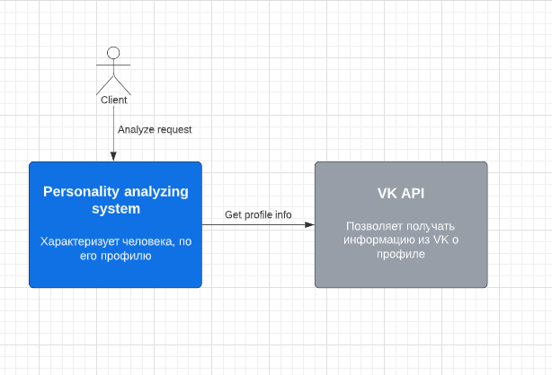
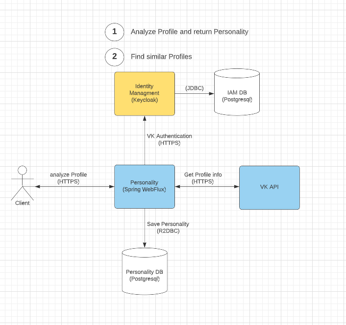

Поиск похожих
=======

Небольшой стартап запустил сервис для поиска людей со схожими интересами,
который сам по профилю в соц. сетях может определять их. Необходимо приложение,
которое будет делать анализ профиля и выдавать совпадающих по интересам других пользователей.

**Users**: пользователи VK

**Requirements**:

* Отображать музыкальные предпочтения (жанры и авторов), конкретные интересы, знак зодиака по открытым данным профиля
* Список подходящих пользователей среди проанализированных и найденных
* Метрики совпадения с текущим пользователем
* Добавить систему тарификации (бесплатный тариф: 3 раза для рескана своего профиля и не более 30 подходящих
  пользователей, начиная с
  наибольшего % совпадения) и подключить платежку
* Быстрый анализ профиля и вывод подходящих пользователей
* Приложение будет в браузере (desktop и mobile) и среди VK Mini Apps
* Удобная система для отзывов и неполадок
* Возможность редактирования интересов и выбора новых

Business goals
-----------
Запустить сервис, который будет поисковиком по людям с похожими интересами.
Компания хочет, чтобы приложение имело небольшую задержку при поиске и анализе.

Business drivers
-----------

* MVP показало, что анализ профиля занимает большое количество времени, из-за чего пользователь закрывает сервис
* Данные о пользователе приходят не полностью из-за ошибок
* Сложность конкурирования приложения как сайта знакомств

Stakeholders
-----------

* Команда разработки
* Пользователь VK
* Служба поддержки (Отвечают на вопросы пользователей, устраняют проблемы с тарифами)

User Stories
-----------
**UC-1:** Первичный анализ:
Пользователь заходит через VK Auth в приложение и нажимает на кнопку анализа, затем через несколько секунд появляется
характеристика профиля, включающая Имя пользователя, Фотографию, Город, Любимые музыкальные жанры и исполнителей,
Интересы, Знак зодиака по гороскопу

**UC-2:** Отображение подходящих:
После анализа профиля появятся карточки других пользователей, на которых будет указан процент совместимости и некоторые
интересы
Когда пользователь нажимает на карточку то кроме информации будет и отображена ссылка на профиль.

**UC-3:** Повторный анализ:
Дано то, что ранее пользователь уже делал сканирование и теперь при нажатии на кнопку "rescan" будет произведен новый
анализ (не взят из бд) и так же будет списан 1 балл за rescan. Потом будут отображены новые подходящие под параметры
пользователи.

**UC-4:** Обновление тарифа:
Пользователь при желании может увеличить количество ресканов и отображаемых карточек.
Тогда на странице тарифов можно будет выбрать удобную платежную систему и обновить тариф

Quality attributes
-----------
* Время анализа профиля не более 5 секунд
* стараться свести к минимуму отсутствующие данные
* отображение подходящих пользователей через 10 секунд (в начальной разработке было 2 мин)

Architecture diagram
-----------
**System diagram**

**Container diagram**

Critical scenarios and characteristics
-----------