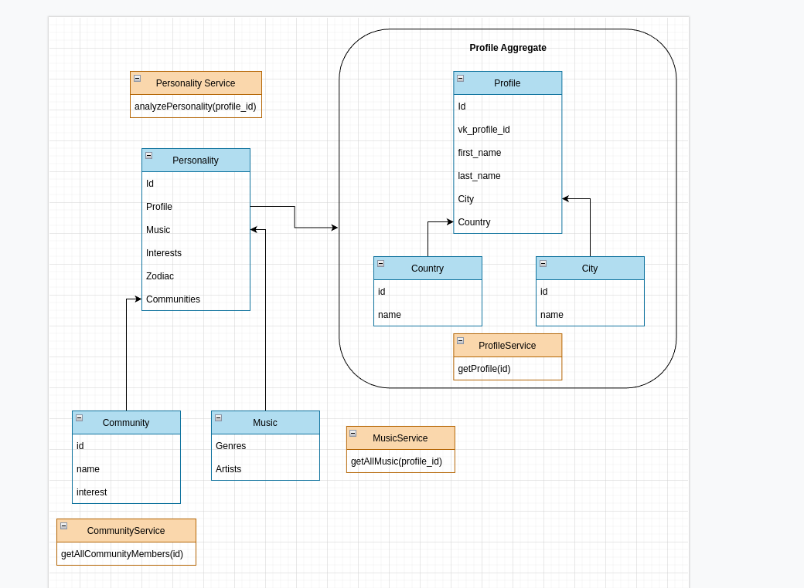

# Тактики работы с модифицируемостью

## Модель предметной области

## Функциональная декомпозиция

## Возможные сценарии изменений в разных модулях

#### DDD декомпозиция

* Поиск среди уже проанализированных профилей (Profile)
* Процент совместимости (Personality) -> _Высокая вероятность_
* Более детальная настройка поиска совпадений, с отключением/включением интересов (Personality + Music + Interests +
  Communities) -> _Средняя вероятность_
* Добавление фонового сервиса, который постоянно анализирует профили (Personality) -> _Средняя вероятность_
* Определение интроверт/экстраверт (Personality) -> _Низкая вероятность_
* Проверка на фейк страницу (Profile) -> _Низкая вероятность_

#### Функциональная декомпозиция по контекстам

* Поиск среди уже проанализированных профилей (Profile + Personality)
* Процент совместимости (Personality)
* Более детальная настройка поиска совпадений, с отключением/включением интересов (Personality + Music + Interests +
  Communities + Profile)
* Добавление фонового сервиса, который постоянно анализирует профили (Personality + Profile) -> _Средняя вероятность_
* Определение интроверт/экстраверт (Personality + Profile)
* Проверка на фейк страницу (Profile + Personality)

### Сравнительный анализ

Решение с декомпозицией по DDD затрагивает меньше сущностей для внедрения нового функционала, соответственно
поддерживать её
становится легче и ресурсов затрачено меньше. Плюс декомпозировать на микросервисы будет легче. Но при этом сама
сущность Personality может стать god object, который со временем станет труднее
поддерживать, так как он будет включать большое кол-во функционала.

В решении с функциональной декомпозицией будет много дублирования кода, возможно из-за этого появятся дополнительные
расходы при взаимодействии микросервисов (дополнительные запросы). Поддержание так же будет трудным в связи с
изменениями сразу в нескольких контекстах.

Поэтому первое решение возможно будет лучше.

